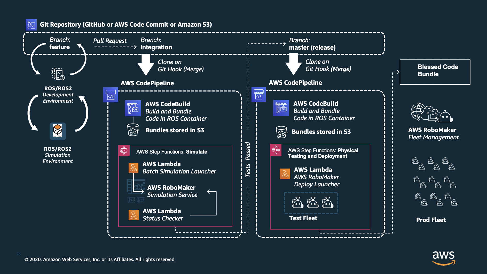

# Launching Batch Simulations in AWS RoboMaker with Code Pipeline and Step Functions
### Version 0.0.2

This serverless back end application will launch a batch set of simulations based on scenarios defined as groups of environment variable key-value pairs.



The application consists of:
- Step Functions State Machine 
- AWS RoboMaker Supporting Resources (Robot, Simulation Application, S3 Bucket, VPC and IAM roles)
- Set of Lambda functions:
  - **triggerStepFunctions**: The lambda function that kicks off the AWS Step Functions state machine from AWS CodePipeline.
  - **processAndLaunchBatchSimulations**: Process the RoboMaker Simulation Scenarios Document and start the batch of simulation jobs. 
  - **checkStatus**: This lambda function runs in a loop, describes the current simulation job and checks the status. Once complete, it sends a set of ARNs to the summary function.
  - **sendSimSummary**: The lambda function that takes an input of ARNs and performs a batch describe simulation job request. It then processes the results looking for failures.
  - **errorLaunchingSimulations**: The error lambda function that captures any failures and fails the CodePipeline job.
- RoboMaker Simulation Scenarios Template Document (JSON,scenarios_template.json)
- template.yaml - The template that creates all of the above resources.


## Event Structure

Here is the event structure (what to send to the lambda function when you invoke it):

```json
    {
        "codePipelineJobID": "<THE ID FROM CODEPIPELINE>",
        "scenarios": {
            "": {
                "robotEnvironmentVariables": {},
                "simEnvironmentVariables": {}
            }
        },
        "simulations": [{
            "scenarios": ["<SCENARIO_NAME>"],
            "params": CreateSimulationJobParams
        }]
    }
```

A **scenario** is created by defining a set of environment variables, a set for the robot and simulation applications defined. The collection of environment variables can be referenced when configuring the simulations jobs that you want to run in parallel. 

**Example Scenario:**
```json
...
      "scenarios": {
        "BasicSlowTest": {
            "robotEnvironmentVariables": {
                "TIME_TEST_LENGTH_IN_SECONDS": "60",
                "SPEED_IN_RADIANS_PER_SECOND": "0.2"
            },
            "simEnvironmentVariables": {}
        }
      }
...
```

Once you have defined a set of scenarios (or more simply, your groups of environment variables) you can associate a scenario with a simulation job. Each scenario, simulation pair will result in a single AWS RoboMaker CreateSimulation API call. For example, the below configuration will create **two** AWS RoboMaker simulation jobs. One for each of the scenarios (BasicSlowTest and LongFastTest). The **params** field expects the same request syntax as what the [create_simulation_job](https://boto3.amazonaws.com/v1/documentation/api/latest/reference/services/robomaker.html#RoboMaker.Client.create_simulation_job) method expects, which is simply the parameters for your simulation job assets. 

```json
...
    "simulations": [{
        "scenarios": ["BasicSlowTest","LongFastTest"],
        "params": {
               "failureBehavior": "Fail",
               "iamRole": "string",
               "maxJobDurationInSeconds": 600,
               "outputLocation": { 
                  "s3Bucket": "<S3_BUCKET_NAME>",
                  "s3Prefix": "logs"
               },
               "robotApplications": [ 
                  { 
                     "application": "<ROBOT_APPLICATION_ARN>",
                     "applicationVersion": "1",
                     "launchConfig": { 
                        "launchFile": "rotate.launch",
                        "packageName": "hello_world_robot"
                     }
                  }
               ],
               "simulationApplications": [ 
                  { 
                     "application": "<SIMULATION_APPLICATION_ARN>",
                     "applicationVersion": "1",
                     "launchConfig": { 
                        "launchFile": "empty_world.launch",
                        "packageName": "hello_world_simulation"
                     }
                  }
               ]
        }
    }]
...
```

## Deploy the sample application

This application has been built using the Serverless Application Model. 

The Serverless Application Model Command Line Interface (SAM CLI) is an extension of the AWS CLI that adds functionality for building and testing Lambda applications. It uses Docker to run your functions in an Amazon Linux environment that matches Lambda. It can also emulate your application's build environment and API.

To use the SAM CLI, you need the following tools.

* AWS CLI - [Install the AWS CLI](https://docs.aws.amazon.com/cli/latest/userguide/cli-chap-install.html) and [configure it with your AWS credentials].
* SAM CLI - [Install the SAM CLI](https://docs.aws.amazon.com/serverless-application-model/latest/developerguide/serverless-sam-cli-install.html)
* [Python 3 installed](https://www.python.org/downloads/)
* Docker - [Install Docker community edition](https://hub.docker.com/search/?type=edition&offering=community)

The SAM CLI uses an Amazon S3 bucket to store your application's deployment artifacts. If you don't have a bucket suitable for this purpose, create one. Replace `YOUR_BUCKET` in the commands in this section with a unique bucket name.

Once ready, run the following commands to build, package and deploy this SAM application.

````bash
sam build --use-container -m ./requirements.txt
sam package --output-template-file package.yml --s3-bucket <YOUR_BUCKET>
sam deploy --template-file package.yml --stack-name cicd_stack --capabilities CAPABILITY_NAMED_IAM --s3-bucket <YOUR_BUCKET>
```

## Add a resource to your application
The application template uses AWS Serverless Application Model (AWS SAM) to define application resources. AWS SAM is an extension of AWS CloudFormation with a simpler syntax for configuring common serverless application resources such as functions, triggers, and APIs. For resources not included in [the SAM specification](https://github.com/awslabs/serverless-application-model/blob/master/versions/2016-10-31.md), you can use standard [AWS CloudFormation](https://docs.aws.amazon.com/AWSCloudFormation/latest/UserGuide/aws-template-resource-type-ref.html) resource types.

## Cleanup

To delete the sample application and the bucket that you created, use the AWS CLI.

```bash
aws cloudformation delete-stack --stack-name cicd_stack
aws s3 rb s3://BUCKET_NAME
```
## Resources

See the [AWS SAM developer guide](https://docs.aws.amazon.com/serverless-application-model/latest/developerguide/what-is-sam.html) for an introduction to SAM specification, the SAM CLI, and serverless application concepts.

Next, you can use AWS Serverless Application Repository to deploy ready to use Apps that go beyond hello world samples and learn how authors developed their applications: [AWS Serverless Application Repository main page](https://aws.amazon.com/serverless/serverlessrepo/)